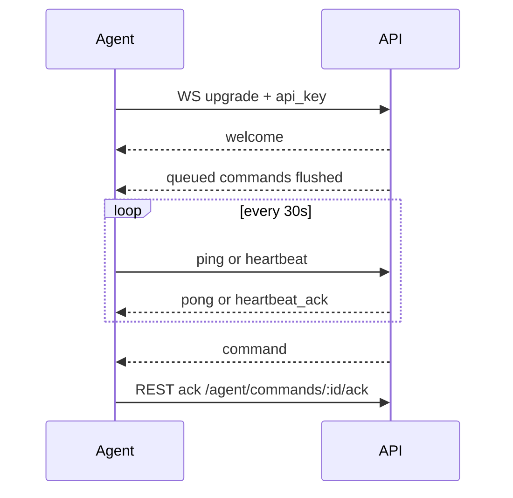

# WebSocket protocol

Endpoint: `GET /ws/agent?api_key=<device_api_key>`

Also accepts `X-Device-API-Key` during the upgrade handshake.

Note: request signing + replay protection (see [rest.md](rest.md)) applies to **REST** agent
endpoints only, since the WS upgrade is a single handshake with no per-message body to sign.
Commands delivered over WS are acked via REST (`/agent/commands/:id/ack`), which is signed.

## Lifecycle



## Server → device

### welcome

```json
{ "type": "welcome", "device_id": "<uuid>", "ts": 1710000000 }
```

### command

```json
{
  "type": "command",
  "id": "<command-uuid>",
  "command": "ping",
  "payload": {}
}
```

### heartbeat_ack / pong

```json
{ "type": "pong", "ts": 1710000000 }
{ "type": "heartbeat_ack", "ts": 1710000000 }
```

## Device → server

```json
{ "type": "ping" }
{ "type": "heartbeat" }
```

## Client requirements

- Auto-reconnect with exponential backoff
- Treat missed pong / read deadline (~90s) as disconnect
- Never drop commands: if WS down, REST will still queue; on reconnect, server flushes `queued` commands
- Prefer REST for large payloads (media, SMS bodies); WS for control plane
