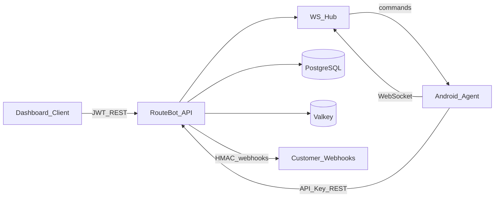

# Architecture overview

RouteBot is a hexagonal / clean-architecture system with two runtimes:

1. **Backend API** (`backend/`) — dashboard JWT auth, device API keys, event ingestion, command queue, log upload storage, HMAC webhooks, WebSocket command delivery.
2. **Android agent** (`android/`) — foreground service, offline queue, collectors/gateways, remote command execution.

## Backend layers

- `cmd/api` — composition root
- `internal/domain` — entities
- `internal/ports` — repository / hub interfaces
- `internal/service` — use cases
- `internal/adapters/*` — Fiber HTTP, WS, Postgres, Redis, webhook dispatcher
- `internal/pkg/*` — JWT, HMAC, response envelope, logger

## Android modules

- `:app` — UI, services, receivers, WorkManager
- `:domain` — models + repository contracts + use cases
- `:data` — Room, Retrofit/OkHttp, Keystore, WebSocket client
- `:core` — device telemetry collectors
- `:common` — constants, Result, logging

## Security defaults

- Passwords: bcrypt
- Device credentials: API keys hashed with pepper (SHA-256)
- Dashboard sessions: JWT access + hashed refresh tokens
- Webhooks: HMAC-SHA256 over `timestamp.body` + skew check
- Agent secrets: Android Keystore + EncryptedSharedPreferences
- Media at rest on device: AES-GCM before upload; delete after successful send

## Dual-SIM

Operators select SIMs with **1-based** tray numbers (`1` = SIM 1, `2` = SIM 2) on SMS and USSD
commands. See [sim-slots.md](sim-slots.md).
