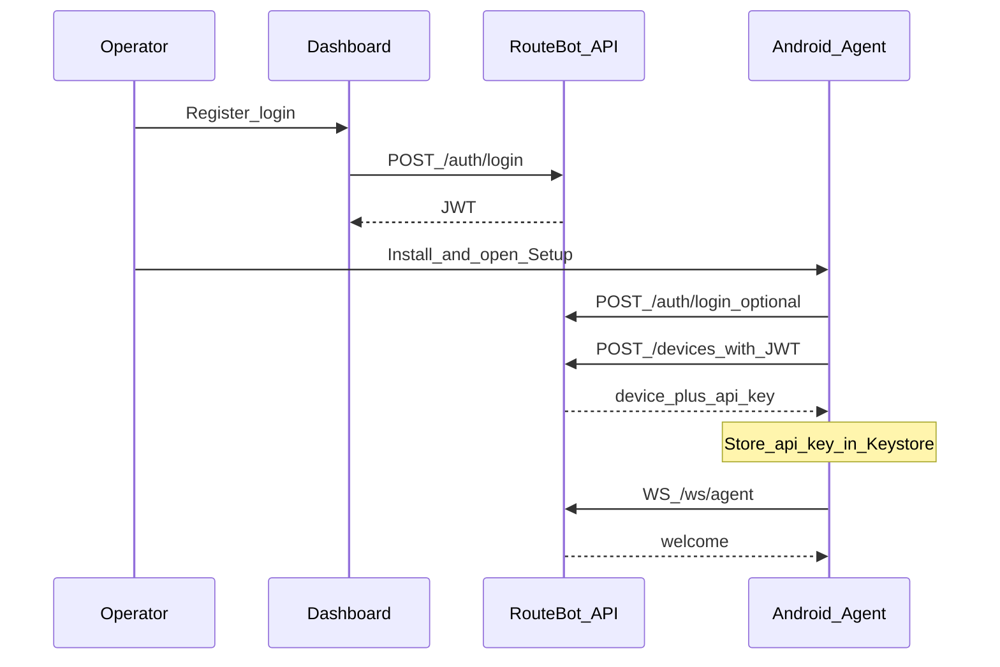
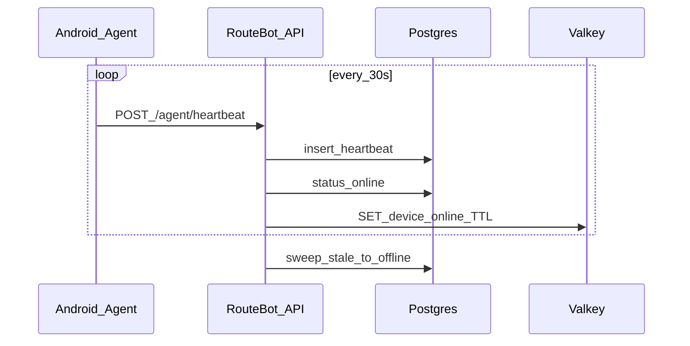
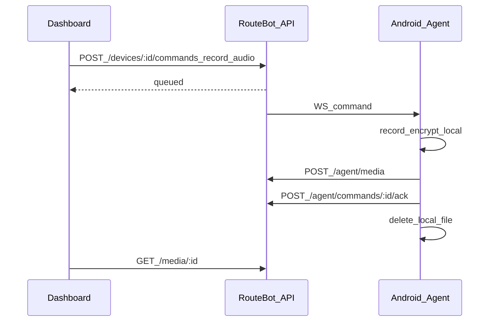
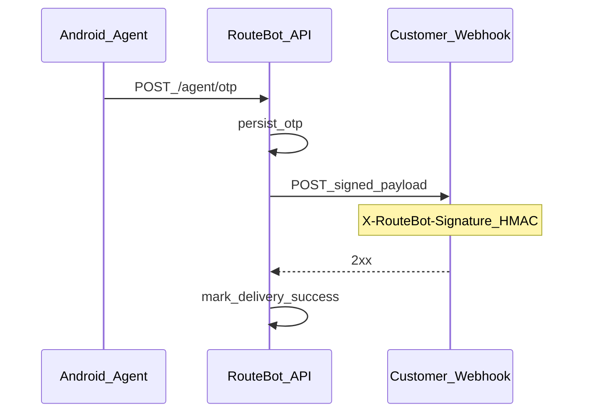

# Sequence diagrams

## Device enrollment

```mermaid
sequenceDiagram
  participant Ops as Operator
  participant Dash as Dashboard
  participant API as RouteBot_API
  participant Agent as Android_Agent
  Ops->>Dash: Register_login
  Dash->>API: POST_/auth/login
  API-->>Dash: JWT
  Ops->>Agent: Install_and_open_Setup
  Agent->>API: POST_/auth/login_optional
  Agent->>API: POST_/devices_with_JWT
  API-->>Agent: device_plus_api_key
  Note over Agent: Store_api_key_in_Keystore
  Agent->>API: WS_/ws/agent
  API-->>Agent: welcome
```

## Heartbeat and offline sweep

```mermaid
sequenceDiagram
  participant Agent as Android_Agent
  participant API as RouteBot_API
  participant PG as Postgres
  participant Redis as Valkey
  loop every_30s
    Agent->>API: POST_/agent/heartbeat
    API->>PG: insert_heartbeat
    API->>PG: status_online
    API->>Redis: SET_device_online_TTL
  end
  API->>PG: sweep_stale_to_offline
```

## Remote command + media

```mermaid
sequenceDiagram
  participant Dash as Dashboard
  participant API as RouteBot_API
  participant Agent as Android_Agent
  Dash->>API: POST_/devices/:id/commands_record_audio
  API-->>Dash: queued
  API->>Agent: WS_command
  Agent->>Agent: record_encrypt_local
  Agent->>API: POST_/agent/media
  Agent->>API: POST_/agent/commands/:id/ack
  Agent->>Agent: delete_local_file
  Dash->>API: GET_/media/:id
```

## Webhook delivery

```mermaid
sequenceDiagram
  participant Agent as Android_Agent
  participant API as RouteBot_API
  participant Hook as Customer_Webhook
  Agent->>API: POST_/agent/otp
  API->>API: persist_otp
  API->>Hook: POST_signed_payload
  Note over Hook: X-RouteBot-Signature_HMAC
  Hook-->>API: 2xx
  API->>API: mark_delivery_success
```
