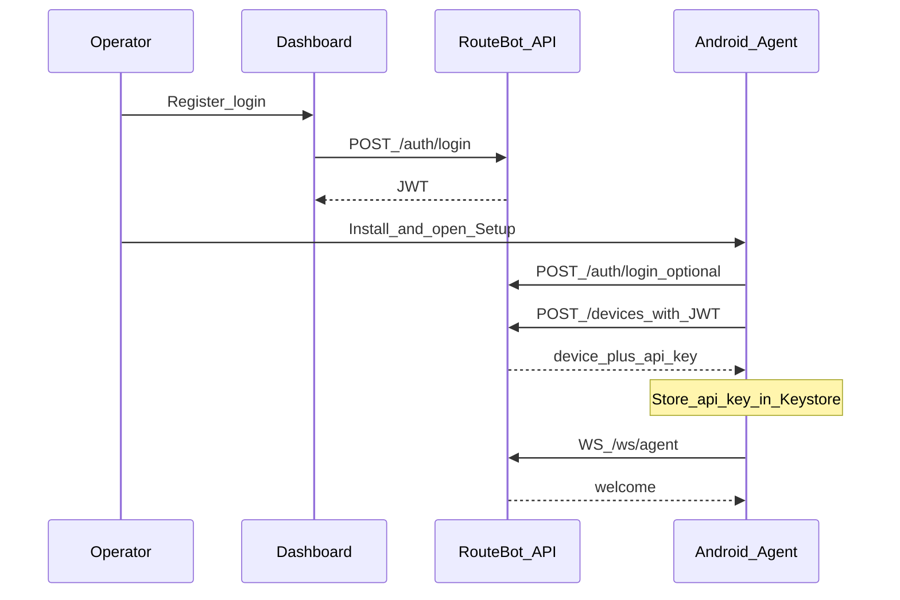
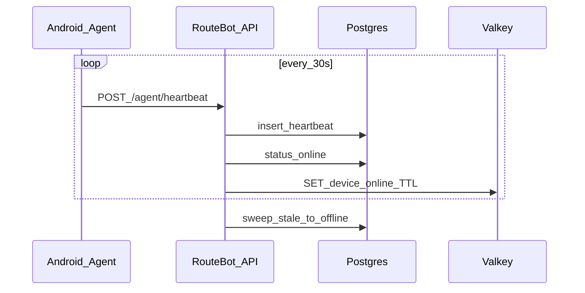
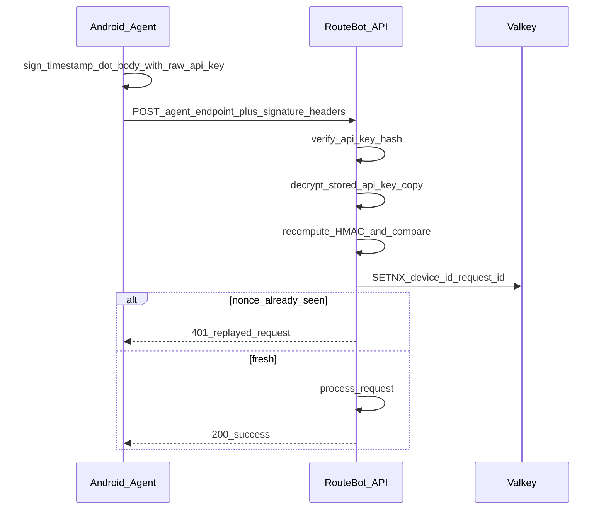
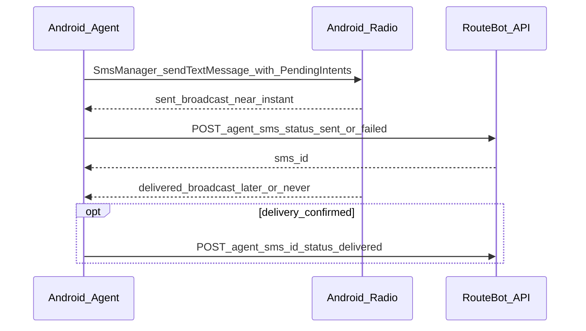
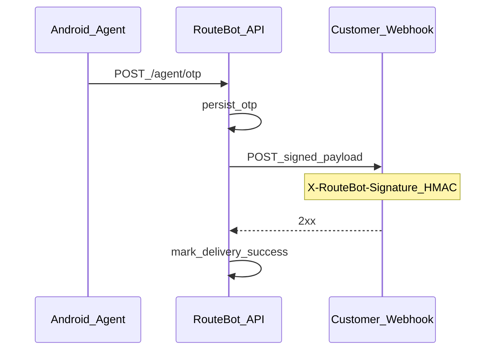

# Sequence diagrams

## Device enrollment

```mermaid
sequenceDiagram
  participant Ops as Operator
  participant Dash as Dashboard
  participant API as RouteBot_API
  participant Agent as Android_Agent
  Ops->>Dash: Register_login
  Dash->>API: POST_/auth/login
  API-->>Dash: JWT
  Ops->>Agent: Install_and_open_Setup
  Agent->>API: POST_/auth/login_optional
  Agent->>API: POST_/devices_with_JWT
  API-->>Agent: device_plus_api_key
  Note over Agent: Store_api_key_in_Keystore
  Agent->>API: WS_/ws/agent
  API-->>Agent: welcome
```

## Heartbeat and offline sweep

```mermaid
sequenceDiagram
  participant Agent as Android_Agent
  participant API as RouteBot_API
  participant PG as Postgres
  participant Redis as Valkey
  loop every_30s
    Agent->>API: POST_/agent/heartbeat
    API->>PG: insert_heartbeat
    API->>PG: status_online
    API->>Redis: SET_device_online_TTL
  end
  API->>PG: sweep_stale_to_offline
```

## Agent request signing and replay protection

```mermaid
sequenceDiagram
  participant Agent as Android_Agent
  participant API as RouteBot_API
  participant Redis as Valkey
  Agent->>Agent: sign_timestamp_dot_body_with_raw_api_key
  Agent->>API: POST_agent_endpoint_plus_signature_headers
  API->>API: verify_api_key_hash
  API->>API: decrypt_stored_api_key_copy
  API->>API: recompute_HMAC_and_compare
  API->>Redis: SETNX_device_id_request_id
  alt nonce_already_seen
    API-->>Agent: 401_replayed_request
  else fresh
    API->>API: process_request
    API-->>Agent: 200_success
  end
```

## SMS delivery report

```mermaid
sequenceDiagram
  participant Agent as Android_Agent
  participant OS as Android_Radio
  participant API as RouteBot_API
  Agent->>OS: SmsManager_sendTextMessage_with_PendingIntents
  OS-->>Agent: sent_broadcast_near_instant
  Agent->>API: POST_agent_sms_status_sent_or_failed
  API-->>Agent: sms_id
  OS-->>Agent: delivered_broadcast_later_or_never
  opt delivery_confirmed
    Agent->>API: POST_agent_sms_id_status_delivered
  end
```

## Webhook delivery

```mermaid
sequenceDiagram
  participant Agent as Android_Agent
  participant API as RouteBot_API
  participant Hook as Customer_Webhook
  Agent->>API: POST_/agent/otp
  API->>API: persist_otp
  API->>Hook: POST_signed_payload
  Note over Hook: X-RouteBot-Signature_HMAC
  Hook-->>API: 2xx
  API->>API: mark_delivery_success
```
